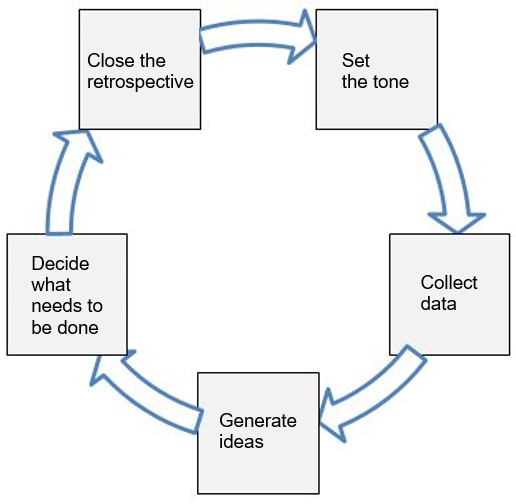
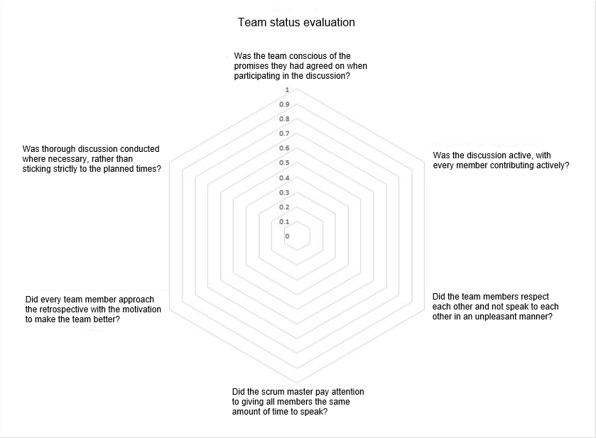

# Sprint retrospective

## Introduction
* The scrum master should ideally be the facilitator, but does not need to be. 
* KPT is used for retrospectives in this example, but the scrum master should choose the best method based on the scrum team’s situation and other factors.

## Workflow of retrospective

Retrospectives comprise the following five steps (see the figure above). 

  1. [Set the tone](#Set-the-tone)
  1. [Collect data](#Collect-data)
  1. [Generate ideas](#Generate-ideas)
  1. [Decide what needs to be done](#Decide-what-needs-to-be-done)
  1. [Close the retrospective](#Close-the-retrospective)

Details on each step are provided below.

##### Set the tone
###### Overview

Creating a suitable atmosphere for discussion enables participants to concentrate on the work that needs to be done after the retrospective.   
Confirm the team’s objectives (what they have promised) and the premises of the discussion.

###### Procedure
1. Announce the beginning of the retrospective. 
1. The facilitator explains how the retrospective will be conducted (time schedule and main topics).
1. Allow enough time for all members to express their opinion, so that everyone feels participating.  
   * Check in with each member and ask for their opinion. 
   * This could be as simple as asking them to sum up how they feel about the progress so far. 
1. Confirm the team’s objectives (what they have promised).

##### Collect data
###### Overview
This is a time for reflecting on what happened during the sprint. The following two types of data are collected:
* Fact-based data: Data for sharing what happened during the sprint with all of the team members.
* Feeling-based data: Data for sharing how team members felt about things that happened and about the sprint as a whole. This makes it possible for team members to understand each other’s perceptions and identify fundamental problems.

###### Procedure

Reflect using KPT.
1. Determine whether the points decided on during the previous retrospective have been achieved (add these to Keep if they are judged to be effective).
1. Seek fact-based data (events, completed functions, completed stories) and feeling-based data (how each team member felt about the points in the fact-based data).
1. Write good points (Keep) and issues (Problems) on Post-It notes.
1. Each team member announces their Keep and Problem points.
  * To maintain an atmosphere of "Problem vs. us", ask all members to gather around the board instead of sitting in their seats.
  * If multiple members have similar opinions, they should stack their Post-Its together in the same place.
  * Always start by announcing the Keep points, as starting with Problem points creates a negative atmosphere.

##### Generate ideas
###### Overview
This is a time for thinking of solutions to problems identified by the team.  
Probe into issues that have been raised and identify the fundamental cause. 
  
###### Procedure  
1. Probe into the problems and bring the true issues to the surface.   
  * Ask “Why?” five times and share the issues that are mentioned (the Five Whys).
  * This method must not be used to blame an individual. This causes the discussion to devolve into an argument about who is to blame instead of identifying the fundamental issue. 
1. Team members suggest specific solutions to the problems that have been identified.

##### Decide what needs to be done  
###### Overview
This is a time for deciding which of the suggested improvement measures should not be used.  
Only 2-3 improvements should be made in each sprint, as there is a limit to how many changes a team can adapt to at once. 
  
###### Procedure 
1. The team votes on which improvements to make in the next sprint.   
1. Decide on objectives to accomplish the improvement measures so that these can be referred to in the next sprint.  
  * Objectives to accomplish the measures must be SMART (specific, measurable, attainable, relevant and timely).
  * The facilitator points out any perspectives that are not SMART enough and revisions are made.

##### Close the retrospective
###### Overview  
This is a time for the scrum master to sum up the retrospective and close the retrospective.  
A retrospective of the retrospective is conducted to inspect and improve on the process of retrospective.  
  
###### Procedure 
1. Confirm decisions that have been made and whether specific actions have been decided on.   
1. Conduct a retrospective of the retrospective to improve on the retrospective process.  
  * Use the retrospective assessment sheet below.

## Points of caution when conducting retrospectives

Below are points that the facilitator needs to be aware of when conducting retrospectives.

##### Time allocated for the retrospective

The length of a retrospective depends on the size of the project, but for projects where two-week sprints are used, retrospectives should be around 1-1.5 hours.
If a retrospective is longer than 90 minutes, a break of around 10 minutes should be taken. 
The following four factors should be considered when setting the length of retrospectives.

 * The length of each sprint
 * The size of the team
 * The complexity (technical complexity, relationship with other departments, configuration of team)
 * The severity of clashes and disagreements that occur

##### Configuration of retrospectives

Below is an example of how the effective time of a 1.5-hour retrospective could be allocated.

| Workflow | Ratio | Time |
| :--- | :--- | :--- |
| Set the tone | 5% | 4.5 min. |
| Collect data | 30-50% | 30 min. |
| Generate ideas | 20-30% | 20 min. |
| Decide what needs to be done | 15-20% | 15 min. |
| Close the retrospective | 10% | 9 min. |
| Transitions* |10-15% | 11.5 min. |
| Total | 100% | 90 min. |

*"Transitions" indicates the time required between activities and time allowed as an overall buffer. 

##### When carrying out activities

The facilitator reads the atmosphere of the room during activities and makes sure the right amount of time is spent on each activity.
During early retrospectives, the facilitator should make notes of times to record how long each activity takes.

##### Setting the atomosphere of the team

The atmosphere needs to be conducive to active discussion.
Below are measures the facilitator can take to enable team members to discuss the matters at hand actively.
 
1. Team members who speak frequently
   * Instruct the whole team not to dominate discussions. If some team members still dominate discussions, this can be addressed directly with those team members.
1. Team members who do not speak much
   * Ask these team members specifically if there is anything they would like to add, although they are not required to answer if they have nothing they would like to say. You could say "X, we haven’t heard from you yet; is there anything you’d like to add?"
1. Team members who break team agreements
   * Address the team as a whole rather than criticizing the individual. Reiterate the agreements when necessary to remind the team.

## Retrospective assessment sheet

Below are the points that need to be reflected on in retrospectives.
Reflection should be done from two perspectives: reflection on actions and reflection on the nature of the discussion. 

* Reflection on actions: The points in a to e. These points are mainly used to evaluate whether the procedures indicated on the sheet were followed.
* Reflection on the nature of the discussion: The points in f. These points are used to evaluate whether the discussions in the retrospective were appropriate.

##### a. Setting the tone
* Were the purposes of the retrospective and the team’s objectives (what they have promised) confirmed?            
* Did the team understand how the retrospective would be conducted?                                    
* Were all of the participants able to speak?                                                    
* Did the retrospective have the positive atmosphere that is needed for discussions on how the team should improve in future?            

##### b. Collecting data
* Were the improvements agreed on at the last retrospective put into action?                                  
* Were issues that were encountered by the team identified?                                         
* Were there no recurring issues?                                                    
* Was feeling-based data collected in addition to objective facts?                   

##### c. Generating ideas
* Was there enough discussion about issues to identify fundamental issues?                 
* Was there enough time to generate ideas?                                       

##### d. Deciding what needs to be done
* Was there a suitable number of actions to improve the team?                                         
* Were these refined into specific actions?                                   
* Was the team able to discuss indexes to judge whether these actions have been sufficiently accomplished?                            

##### e. Closing the retrospective
* Were records taken about what was decided and what was learned during the retrospective?                    
* Was a retrospective of the retrospective conducted to reflect on whether the retrospective was conducted effectively?

##### f. Nature of discussion

* Was the team conscious of the promises they had agreed on when participating in the discussion?                              
* Was the discussion active, with every member contributing actively?                                
* Did the team members respect each other and not speak to each other in an unpleasant manner?           
* Did the scrum master pay attention to giving all members the same amount of time to speak?                
* Did every team member approach the retrospective with the motivation to make the team better?      
* Was thorough discussion conducted where necessary, rather than sticking strictly to the planned times?             

## Source
1. Derby, Esther and Larsen, Diana. _Ajairu Retorosupekutibuzu: Tsuyoi Chīmu O Sodateru “Furikaeri” No Tebiki_, translated by Masanori Kado, Ohmsha, Ltd., 2007. pp. 184.
(original title: _Agile Retrospectives: Making Good Teams Great_)
