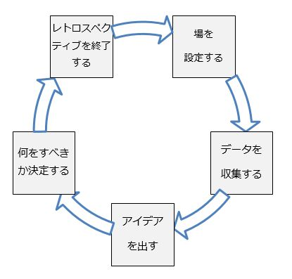
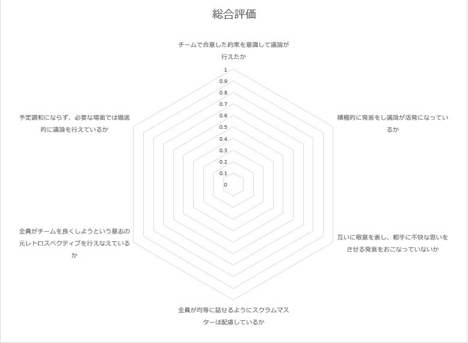
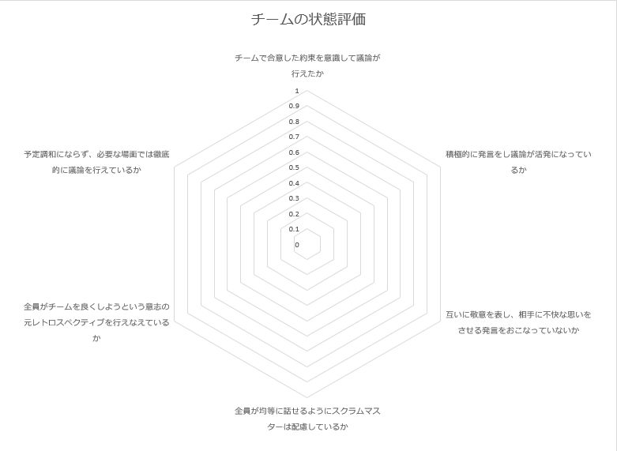

# スプリントレトロスペクティブ

## はじめに
* ファシリテーターを行うのはスクラムマスターが行うのが望ましいですが、必ずしもスクラムマスターである必要はありません。
* ここではKPTによる振り返りを例にしていますが、スクラムチームの状況等に応じて、より最適な手段をスクラムマスターが決めてください。

## レトロスペクティブの流れ

レトロスペクティブは以下の5つの要素で構成されています（上図参照）。

  1. [場を設定する。](#場を設定する)
  1. [データを収集する。](#データを収集する)
  1. [アイデアを出す。](#アイデアを出す)
  1. [何をすべきか決定する。](#何をすべきか決定する)
  1. [レトロスペクティブを終了する。](#レトロスペクティブを終了する)

それぞれの詳細は下記で説明します。

##### 場を設定する
###### 概要

議論に適した雰囲気を作ることで参加者がこれから行う作業に集中できるようにする時間です。  
チームの目標（約束）を確認し、議論を行う上での前提を確認します。

###### 手順
1. 開始の挨拶をします。「それではただ今より【スプリント名】の振り返りを開始します。」
1. ファシリテーターは進め方（タイムスケジュール、主要テーマ）の説明を行います。
1. 全員参加の雰囲気を作るため、メンバー全員が意見を言える時間を取ります。  
  *「チェックインを行います。〇〇について一言でお願いします。」
    * 例：今の気持ちを一言でお願いします
1. チームの目標（約束）を確認します。

##### データを収集する
###### 概要
スプリント期間中の出来事を振り返る時間です。データを収集する際には以下の2種類のデータを集めます。
* 事実ベースのデータ：スプリント中に何が起きたかをメンバー全員が共有するためのデータ。
* 感情のデータ：起きた出来事に対してどう感じたか、またはスプリント全体で感じたことを共有することで  お互いの認識を理解し、本質的な問題を浮き彫りにするためのデータ。

###### 手順

KPTによる振り返りを行います。
1. 前回のレトロスペクティブ時の決定事項について達成できたか検討します（有用と判断された場合Keepに追加します）。
1. イベント、完了した機能、完了したストーリーといった事実ベースのデータと、事実ベースのデータに対して各々が感じた感情のデータを洗い出します。
1. その中で良かったこと（Keep）と問題だなと感じたこと（Problem）をポストイットに書き出します。
1. 順番にKeepとProblemを発表します。ボードにポストイットを貼ります。
  * Problem vs. usの雰囲気を出すために、全員イスから立ち、ボードを囲むようにします。
  * この際に、他者から自分と似た意見が出たら、そのポストイットに自分のポストイットも重ねて貼ります。
  * Problemから話を始めると雰囲気が暗くなるので、必ずKeepから発表してください。

##### アイデアを出す
###### 概要
チームで洗い出した問題に対する解決策を考える時間です。  
挙がった問題を深掘りし、本質的な原因を突き止めます。
  
###### 手順  
1. 問題の掘り下げを行い、真の問題を表面化させます。  
  * 「なぜ？」という問いかけを5回繰り返して、出てきた問題点を共有します。（The Five Whys）
  * 原因を個人の責任に求めてはいけません。本質的な問題点をあぶりだせないどころか個人の責任追及の時間になってしまいます。
1. 出てきた問題に対して具体的な解決策を提示しあいます。

##### 何をすべきか決定する  
###### 概要
複数出てきた改善策の中で「しないこと」を決める時間です。  
多すぎると変化に対応できる限界を超えてしまうため目安として1スプリントにつき2～3個までにします。
  
###### 手順 
1. 投票を行ってチームとして次スプリントで行う改善策を決定します。  
1. 次回のスプリントで振り返れるように、改善策の達成目標を決めます。  
  * 達成目標はSMART（Specific(明確な)、Measurable(計測可能な)、Attainable(達成可能な)、Relevant(適切な)、Timely(タイムリーな)）にしてください。
  * SMARTに足りない視点があれば、ファシリテーターが指摘し、修正をはかってください。

##### レトロスペクティブを終了する
###### 概要  
スクラムマスターがまとめを行い、レトロスペクティブを終了する時間です。  
またレトロスペクティブのレトロスペクティブを行い、点検と改善を図ります。
  
###### 手順 
1. 決定した事項、それに対する具体的なactionまで決定しているか確認します。  
1. レトロスペクティブのレトロスペクティブを行い、レトロススペクティブのプロセスの改善を図ります。  
  * 下記に示す「レトロスペクティブアセスメントシート」を利用する。

## レトロスペクティブ実施の注意点

以下ではレトロスペクティブを実施するにあたってファシリテーターが留意すべき事項を記載します。

##### レトロスペクティブの所要時間について

プロジェクト規模にもよりますが、２週間を1スプリントとした場合、1～1.5時間を目安にします。
90分を超す場合は休憩時間を10分程度確保します。
また所要時間を考える際は、以下の４つの要因を考慮しましょう。

 * 1スプリントの長さ
 * チームの大きさ
 * 複雑さ（技術、他部署との関係、チームの構成）
 * 衝突や意見の対立度合

##### レトロスペクティブの構成

以下に1.5時間のレトロスペクティブに有効な時間配分例を記載します。

| 流れ | 割合 | 時間 |
| :--- | :--- | :--- |
| 場を設定する | 5% | 4.5分 |
| データを収集する | 30-50% | 30分 |
| アイデアを出す | 20-30% | 20分 |
| 何をすべきか決定する | 15-20% | 15分 |
| レトロスペクティブを終了する | 10% | 9分 |
| 切り替え時間 |10-15% | 11.5分 |
| 合計 | 100% | 90分 |

※「切り替え時間」とはアクティビティ間に必要な時間、全体のバッファの時間を指します。

##### アクティビティを実施するにあたって

ファシリテーターはアクティビティを行っている最中は部屋の様子を観察し、アクティビティの時間が十分か気を配ります。
最初のうちは時間をメモし、どの程度時間がかかるか記録を取っておくと良いです。

##### チームの雰囲気を作るにあたって

ここで言う雰囲気とは積極的に議論が行われる雰囲気のことです。
以下にチームメンバーが積極的に議論を行えるようにファシリテーターができることを記載します。
 
1. よく話す人
  * あまりしゃべりすぎないように全体に向けて促します。それでもおさまらない場合は個人的に注意しても良いです。
1. あまり話さない人
  * 何か言いたいことはないか。こちらから尋ねてみてください。その際、回答をパスすることも認めてあげてください。
    * 例「○○さんの意見を聞けていませんが、何か言うことはありますか？」
1. チームの合意事項を破る人
  * 個人を非難するのではなく、チーム全体に発信しましょう。また都度都度チームの合意事項を再度復唱し、思い出してもらいます。

## レトロスペクティブアセスメントシート

以下ではレトロスペクティブにおいて振り返るべき項目について記載します。
振り返りの観点として行動ベース、状態ベースの2観点が挙げられます。

* 行動ベース：a～eに該当します。主に「レトロスペクティブの流れ」シートに記載された手順で記載された事項が行われたか評価する項目です。
* 状態ベース：fに該当します。あるべきレトロスペクティブになっていたかを評価する項目です。

##### a 場を設定する
* レトロスペクティブの目的およびチームの目標（約束）を確認できているか            
* レトロスペクティブの進め方を理解できているか                                    
* 参加者は全員発言できているか                                                    
* これからチームを改善する議論を行うための前向きな雰囲気になっているか            

##### b データを収集する
* 前回合意した改善アクションを実行しているか                                  
* チームの問題点を洗い出せているか                                         
* 毎回同問題がでてないか                                                    
* 客観的な事実のみではなく感情面のデータも収集できているか                   

##### c アイデアを出す
* 問題点について十分議論し。本質的な問題点を洗い出せているか                 
* アイデアを出す時間を十分とれているか                                       

##### d 何をすべきか決定する
* チーム改善のアクションは妥当な数か                                         
* 具体的なアクションまで落とし込めているか                                   
* 達成状況を判断する指標について話し合えているか                            

##### e レトロスペクティブを終了する
* レトロスペクティブで決まったこと、学んだことを記録しているか                    
* レトロスペクティブのレトロスペクティブを行い効果的に行えたか振り返れていること

##### f チームの状態

* チームで合意した約束を意識して議論が行えたか                              
* 積極的に発言をし議論が活発になっているか                                
* 互いに敬意を表し、相手に不快な思いをさせる発言をおこなっていないか           
* 全員が均等に話せるようにスクラムマスターは配慮しているか                
* 全員がチームを良くしようという意志の元レトロスペクティブを行えなえているか      
* 予定調和にならず、必要な場面では徹底的に議論を行えているか             

## 参考文献
1. Derby,Esther ; Larsen,Diana. アジャイルレトロスペクティブズ:強いチームを育てる「ふりかえり」の手引き. 角征典訳. オーム社. 2007. 184p.
